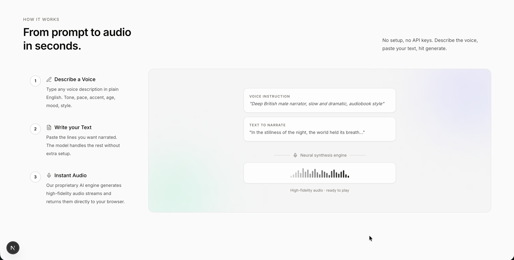

# VoiceForge

Generate any voice in plain English. Describe the tone, accent, age, and style — VoiceForge turns it into studio-quality audio instantly. No account, no credits, no setup.

---

## UI Preview


*Hero page — describe any voice, get audio in seconds*



*How it works — voice instruction → neural synthesis → high-fidelity audio*

---

## How It Works

```
User types:
  Voice Instruction → "Deep British male narrator, slow and dramatic"
  Text to Narrate  → "In the stillness of the night..."
                          │
                          ▼
          ┌───────────────────────────────┐
          │     Frontend (Next.js)        │
          │  Health check + auto-retry    │
          └────────┬──────────────────────┘
                   │
         ┌─────────┴──────────┐
         ▼                    ▼
   Google Colab           Kaggle
   Qwen3-TTS             Qwen3-TTS
   T4 GPU                T4 GPU
   ngrok tunnel          Cloudflare tunnel
         │                    │
         └─────────┬──────────┘
                   ▼
          High-fidelity audio
          played in browser
```

The frontend tries Colab first. If it fails or times out, it automatically retries on Kaggle — no user action needed.

---

## Project Structure

```
Audiobook/
├── frontend/               # Next.js 15 web app
│   ├── app/
│   │   ├── page.tsx        # Entire single-page app (UI + logic)
│   │   └── globals.css     # Design tokens + component styles
│   ├── lib/
│   │   ├── servers.ts      # Backend URL configuration
│   │   └── constants.ts    # Supported languages
│   └── .env.local          # Backend URLs (not committed)
├── Notebook/
│   ├── Colab_Notebook.ipynb    # Google Colab backend
│   └── Kaggle_Notebook.ipynb   # Kaggle backend
├── UI/                     # UI screenshots
└── README.md
```

---

## Quick Start

### 1. Clone and install

```bash
cd frontend
npm install
```

### 2. Start a GPU backend (Colab or Kaggle — see guides below)

### 3. Add the backend URL to `.env.local`

```env
NEXT_PUBLIC_COLAB_URL=https://your-ngrok-url.ngrok-free.app
NEXT_PUBLIC_KAGGLE_URL=https://your-cloudflare-url.trycloudflare.com
```

You only need one backend. Both is ideal for redundancy.

### 4. Run the frontend

```bash
npm run dev
```

Open [http://localhost:3000](http://localhost:3000).

---

## Google Colab — Setup Guide

The Colab notebook runs a FastAPI server on a free T4 GPU and exposes it via an ngrok tunnel.

### Prerequisites

- Google account
- Free ngrok account → get your token at [dashboard.ngrok.com](https://dashboard.ngrok.com)

### Step 1 — Open the notebook

Open `Notebook/Colab_Notebook.ipynb` in [Google Colab](https://colab.research.google.com).

Or use the direct upload: **File → Upload notebook → select `Colab_Notebook.ipynb`**

### Step 2 — Enable GPU

1. Go to **Runtime → Change runtime type**
2. Set **Hardware accelerator** to **T4 GPU**
3. Click **Save**

### Step 3 — Add ngrok token to Colab Secrets

1. Click the 🔑 **key icon** in the left sidebar
2. Click **+ Add new secret**
3. Name: `NGROK_AUTHTOKEN`
4. Value: your token from [dashboard.ngrok.com](https://dashboard.ngrok.com)
5. Toggle **Notebook access** to **ON**

### Step 4 — Run all cells in order

**Cell 1 — Install dependencies**
```python
!pip install -U qwen-tts fastapi uvicorn pyngrok nest-asyncio soundfile -q
```
Confirms CUDA is available and prints the GPU name.

**Cell 2 — Load model**
Downloads `Qwen3-TTS-12Hz-1.7B-VoiceDesign` (~3.5 GB on first run, cached after). Runs a quick test generation to confirm everything works.

> ⚠️ First run takes 3–5 minutes to download the model. Subsequent runs load from cache instantly.

**Cell 3 — Start FastAPI server**
Sets up the API with two endpoints:
- `GET /` — health check
- `POST /generate` — voice generation

**Cell 4 — Start ngrok tunnel**
Starts the server and prints your public URL:

```
============================================================
  ✅ COLAB API URL  : https://xxxx-xxxx.ngrok-free.app
  🔍 Health Check   : https://xxxx-xxxx.ngrok-free.app/
  🎙️  Generate Voice : https://xxxx-xxxx.ngrok-free.app/generate
============================================================
  ⚠️  Copy this URL into your frontend SERVERS config!
============================================================
```

### Step 5 — Update `.env.local`

Copy the URL and paste it:

```env
NEXT_PUBLIC_COLAB_URL=https://xxxx-xxxx.ngrok-free.app
```

Restart the Next.js dev server. Done.

### Notes

- The session stays alive as long as the notebook is open. A heartbeat thread prevents idle disconnection.
- Free Colab sessions disconnect after ~12 hours of inactivity or ~90 minutes if the browser tab is closed.
- The ngrok URL changes every time you restart Cell 4. Update `.env.local` when it does.

---

## Kaggle — Setup Guide

The Kaggle notebook is identical to Colab except it uses a Cloudflare tunnel instead of ngrok (no token needed).

### Prerequisites

- Kaggle account (free)
- Internet enabled on the notebook

### Step 1 — Open the notebook

Upload `Notebook/Kaggle_Notebook.ipynb` to [kaggle.com/code](https://www.kaggle.com/code):

1. Go to **Code → New Notebook**
2. Click **File → Import Notebook**
3. Upload `Kaggle_Notebook.ipynb`

### Step 2 — Enable GPU

1. In the right panel, under **Session options**, click **Accelerator**
2. Select **GPU T4 x2**
3. Make sure **Internet** is toggled **ON**

### Step 3 — Run all cells in order

**Cell 1 — Install dependencies**
Same as Colab. Confirms CUDA + Tesla T4 available.

**Cell 2 — Load model**
Downloads Qwen3-TTS (~3.5 GB). Saves a test WAV to `/kaggle/working/test.wav`.

> ⚠️ Kaggle caches dataset downloads but not pip packages. Cell 1 re-installs on every session (~2 min).

**Cell 3 — Start FastAPI server**
Same API as Colab. `PLATFORM` is set to `"kaggle"` so the frontend can identify which server served the request.

**Cell 4 — Start Cloudflare tunnel**
Installs `cloudflared`, starts the tunnel, and prints:

```
============================================================
  ✅ KAGGLE API URL : https://xxxx-xxxx.trycloudflare.com
  🔍 Health Check   : https://xxxx-xxxx.trycloudflare.com/
  🎙️  Generate Voice : https://xxxx-xxxx.trycloudflare.com/generate
============================================================
  ⚠️  Copy this URL into your frontend SERVERS config!
============================================================
```

### Step 4 — Update `.env.local`

```env
NEXT_PUBLIC_KAGGLE_URL=https://xxxx-xxxx.trycloudflare.com
```

### Notes

- Kaggle gives **30 GPU hours/week** on the free tier.
- Cloudflare free tunnels have a **100-second request timeout**. The frontend accounts for this and retries on Colab if Kaggle times out.
- The URL changes every time Cell 4 is re-run.
- Keep the notebook tab open to keep the session alive.

---

## Voice Instruction Guide

The voice instruction field controls everything. Write it in English regardless of the output language.

| Goal | Example instruction |
|---|---|
| Audiobook narrator | `"A deep, resonant male voice, slow and dramatic, narrator style"` |
| News anchor | `"Professional female news anchor, neutral American accent, confident and clear"` |
| Meditation guide | `"Soft, breathy female voice, slow pace, calm and soothing"` |
| Podcast host | `"Casual male voice, mid-30s, conversational, warm and friendly"` |
| Corporate explainer | `"Authoritative British male, professional and measured"` |
| Announcer | `"Energetic male voice, fast pace, enthusiastic, sports commentator style"` |

**Advanced pattern:**
```
Voice: [description — gender, age, quality]
Accent: [accent or dialect]
Pace: [slow / medium / fast]
Emotion: [calm / excited / serious]
Style: [conversational / formal / dramatic]
```

**Limits:** Voice instruction max 300 characters. Text to narrate max 500 characters.

---

## Supported Languages

| Language | Code |
|---|---|
| English | `English` |
| Chinese | `Chinese` |
| Japanese | `Japanese` |
| Korean | `Korean` |
| German | `German` |
| French | `French` |
| Russian | `Russian` |
| Portuguese | `Portuguese` |
| Spanish | `Spanish` |
| Italian | `Italian` |

> Write the voice instruction in English even when generating audio in another language — the model interprets tone, accent, and style best in English.

---

## API Reference

Both backends expose the same API.

### Health check

```
GET /
```

Response:
```json
{
  "status": "ok",
  "platform": "colab",
  "model": "Qwen3-TTS-12Hz-1.7B-VoiceDesign",
  "gpu": "Tesla T4",
  "supported_languages": ["English", "Chinese", ...]
}
```

### Generate voice

```
POST /generate
Content-Type: application/json
```

Request:
```json
{
  "text": "Text you want narrated (max 500 chars)",
  "instruct": "Voice description in English (max 300 chars)",
  "language": "English"
}
```

Response:
```json
{
  "audio_b64": "<base64-encoded WAV>",
  "sample_rate": 24000,
  "platform": "colab",
  "duration_seconds": 4.2
}
```

---

## Tech Stack

| Layer | Technology |
|---|---|
| Frontend | Next.js 15, TypeScript, Tailwind CSS |
| UI components | Lucide React, Phosphor Icons, Sonner |
| AI model | Qwen3-TTS-12Hz-1.7B-VoiceDesign (Apache 2.0) |
| Backend framework | FastAPI + Uvicorn |
| Colab tunnel | ngrok (pyngrok) |
| Kaggle tunnel | Cloudflare Tunnel (cloudflared) |
| GPU | NVIDIA Tesla T4 |

---

## Troubleshooting

**"All servers failed to generate"**
Both backends are unreachable. Check:
- The notebook Cell 4 is still running (not timed out)
- The URL in `.env.local` matches the current tunnel URL
- You restarted the Next.js dev server after updating `.env.local`

**"Server timed out"**
The Kaggle Cloudflare tunnel has a 100s hard limit. The frontend automatically retries on Colab. If both time out, the model may be loading — wait 2 minutes and try again.

**Colab says "CUDA not available"**
You didn't enable the GPU runtime. Go to **Runtime → Change runtime type → T4 GPU**.

**ngrok URL stopped working**
Free ngrok URLs expire when the tunnel is restarted. Re-run Cell 4 in Colab to get a new URL and update `.env.local`.

---

## License

Model: [Qwen3-TTS](https://huggingface.co/Qwen/Qwen3-TTS-12Hz-1.7B-VoiceDesign) — Apache 2.0  
Frontend: MIT
